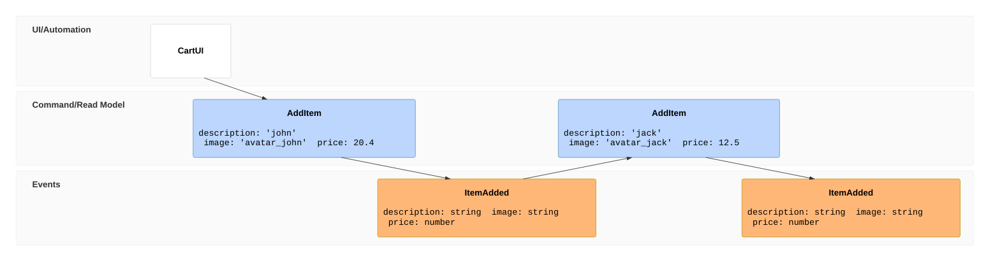

GitHub currently runs the following Mermaid version:

```mermaid
  info
```

Example of event model in a markdown document rendered in GitHub




```mermaid

eventmodeling

tf 01 rmo Pending_Questions { How many invoices were sent out yesterday? }
tf 02 pcr Agent_A
tf 03 cmd InvokeModel { question }
tf 04 evt InvocationCompleted
tf 05 rmo InvocationResult { callTool: findInvoices }
rf 06 rmo Invoices
tf 07 pcr Agent_A ->> 05 ->> 06
tf 08 cmd InvokeModel { toolResult }
tf 09 evt InvocationCompleted
tf 10 rmo Answers [[Answers10]]
rf 11 rmo InvocationResult
tf 12 pcr AgentB

data Answers10 {
  2 invoices were sent out 
  yesterday to customers X and Y
}
```

